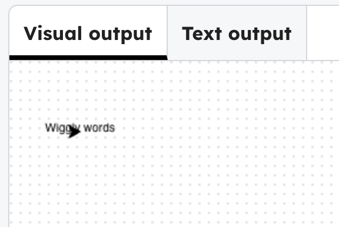

## Draw a line of words

Use the code below and replace `'Wiggly words'` with your own text.

--- code ---
---
language: python
filename: main.py
line_numbers: true
line_number_start: 4
line_highlights: 7-8
---
penup()
speed(20)

# first line
goto(-140, 140)
write('Wiggly words', align='center')
--- /code ---

### Now run your code
The turtle moves to the top left. You can change the animation speed by editing the `speed()` value.

> ### Tip
>
> `align='center'` makes the words appear in a line. Try removing this to see it aligned to the left.
{: .c-project-callout .c-project-callout--tip}
