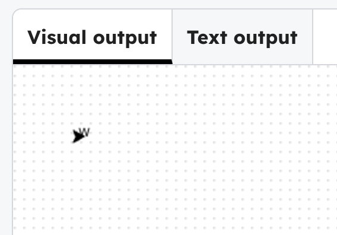

## Move the words into a list

Add a list near the top of the code, and replace your text with `line1[0]`.

--- code ---
---
language: python
filename: main.py
line_numbers: true
line_number_start: 4
line_highlights: 7, 11
---
penup()
speed(20)

line1 = list('Wiggly words')  # Make a list from your text

# first line
goto(-140, 140)
write(line1[0], align='center')
--- /code ---

> ### Tip
>
> The list stores each letter separately so you can use them one at a time.
> `[0]` is the first letter, because computers start counting from 0.
{: .c-project-callout .c-project-callout--tip}

### Now run your code
The first letter, `W`, appears in the turtle window.

