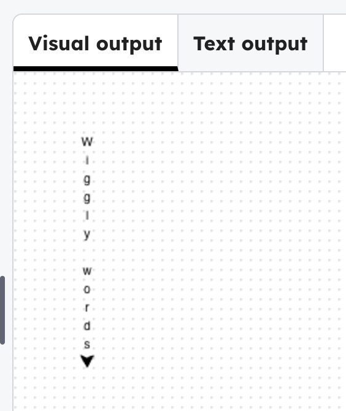

## Make a loop for the first line

Replace the code that writes `line1[0]` with this loop.

--- code ---
---
language: python
filename: main.py
line_numbers: true
line_number_start: 8
line_highlights: 11-13
---
# first line
goto(-140, 140)
right(90)
for i in range(len(line1)): 
    write(line1[i], align='center')
    forward(15)
--- /code ---

### Now run your code
The letters in `Wiggly words` appear one at a time.

> ### Tip
>
> `len(line1)` counts how many items are in the list.
{: .c-project-callout .c-project-callout--tip}

> ### Debugging
>
> The two lines inside the loop must be indented.
{: .c-project-callout .c-project-callout--debug}
