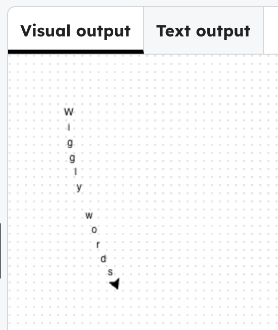

## Make the letters wiggly

Play with random angles using `randint()` that adds a random wobble to each letter.

> ### Tip
>
> `left(randint(-8,8))` chooses a random angle to turn the turtle left with, between -8 and 8 degrees. 
{: .c-project-callout .c-project-callout--tip}

--- code ---
---
language: python
filename: main.py
line_numbers: true
line_number_start: 9
line_highlights: 15
---
# first line
goto(-140, 140)
right(90)
for i in range(len(line1)): 
    write(line1[i], align='center')
    forward(15)
    right(randint(-8,8))
--- /code ---

### Now run your code

The letters appear with a random wobble each time you run it. Experiment with different random values.

