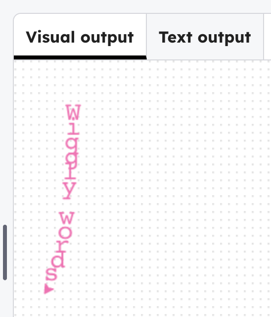

## Style the text

Change the font, size and colour to how you want.

> ### Tip
>
> Add `hideturtle()` to hide the arrow when it has finished drawing.
{: .c-project-callout .c-project-callout--tip}

--- code ---
---
language: python
filename: main.py
line_numbers: true
line_number_start: 4
line_highlights: 5, 8, 13-14
---
penup()
hideturtle()

line1 = list('Wiggly words')  # List from a string
style1 = ('Courier', 20)

# first line
goto(-140, 140)
right(90)
color('hotpink')
for i in range(len(line1)):  #  Gets length of a list
    write(line1[i], font=style1, align='center')
--- /code ---

### Now run your code

See the new style, and change the colour and font to how you want it.

