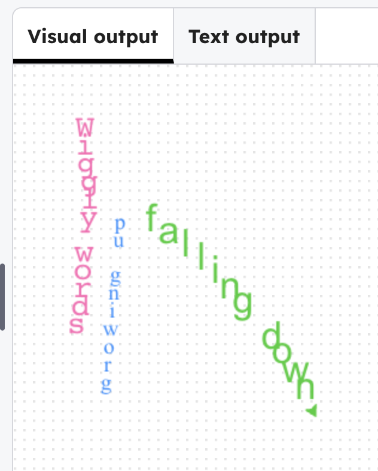

## Make more lines of poetry

### Step 1
Add two more lists after `line1`. Replace the text with your own words.

--- code ---
---
language: python
filename: main.py
line_numbers: true
line_number_start: 8
line_highlights: 11-15
---
line1 = list('Wiggly words')  # List from a string
style1 = ('Courier', 20)

line2 = list('growing up')
style2 = ('Times New Roman', 14)

line3 = list('falling down')
style3 = ('Arial', 24)
--- /code ---

### Step 2
Add the loops for the text.

--- code ---
---
language: python
filename: main.py
line_numbers: true
line_number_start: 29
line_highlights: 32-49
---
    forward(15)
    right(randint(-8,8))

# up line
forward(30)
left(90)
forward(30)
left(90)
color('dodgerblue')
for i in range(len(line2)):
    write(line2[i], font=style2, align='center')
    forward(15)

# falling down
right(120)
forward(30)
color('limegreen')
for i in range(len(line3)):
    write(line3[i], font=style3, align='center')
    forward(randint(15,20))
    right(randint(2,3))
--- /code ---

### Now run your code
Two more lines of the poem should animate. Experiment with the styles and position to draw the words how you want them.

