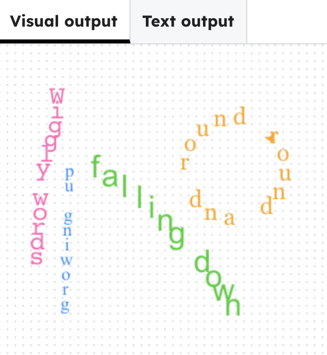

## Make words go around in a circle

### Step 1
Add `line4` text and choose `style4` font.

--- code ---
---
language: python
filename: main.py
line_numbers: true
line_number_start: 14
line_highlights: 16-17
---
style3 = ('Arial', 24)

line4 = list('round and round ') 
style4 = ('Georgia', 18)
--- /code ---

### Step 2
Use another loop and a turn angle to place words around a circle.

> ### Tip
>
> `360 / len(line4)` splits a full turn into equal parts.
{: .c-project-callout .c-project-callout--tip}

--- code ---
---
language: python
filename: main.py
line_numbers: true
line_number_start: 39
line_highlights: 43-49
---
    write(line3[i], font=style3, align='center')
    forward(randint(15,20))
    right(randint(2,3))

# circle 
goto(80, 100)
color('orange')
for i in range(len(line4)):
    write(line4[i], font=style4, align='center')
    forward(20)
    right(360 / len(line4)) #  turn fraction of a circle
--- /code ---

### Now run your code

The words appear arranged in a circle on the right of the screen. Change the number in `forward(20)` to change the circle size.

