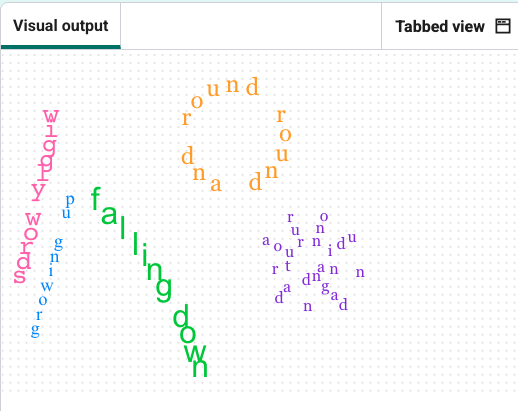

## Challenge: make a spiral

Add a text in a spiral, which looks like it is radiating from the centre, it looks like a flower or a snail shell.

Work in the same way as the previous steps, here is some code to help you get started.

### Step 1
Add a new list and style for the spiral words.

--- code ---
---
language: python
filename: main.py
line_numbers: true
line_number_start: 20
line_highlights: 20-21
---
line5 = list('and round and round they go')
style5 = ('Georgia', 12)
--- /code ---

### Step 2
Add the spiral loop after your circle code.

--- code ---
---
language: python
filename: main.py
line_numbers: true
line_number_start: 59
line_highlights: 59-67
---
# spiral
goto(120, -50)
color('blueviolet')
step = 10  # starting step size - gets bigger each time
for i in range(len(line5)):
    write(line5[i], font=style5, align='center')
    right(40)
    forward(step)
    step += 1  # increase this to spiral out more
--- /code ---

> ### Tip
>
> Change `step += 1` to make the spiral spread out wider.
{: .c-project-callout .c-project-callout--tip}
